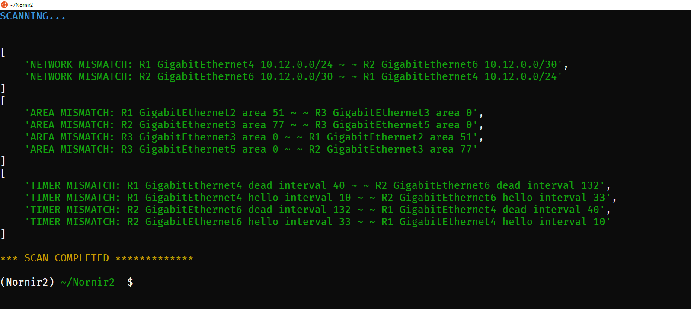

## Purpose: 
Automated Check to check OSPF links are share the same network/mask, area and timers.
Be aware that as CDP is used you will see the mismatch from both traffic directions 
ie: it will show a failure from R1 to R2, as well as R2 back to R1.
This is the same mismatch shown from both perspectives of each device.

## Scope: 
This script uses CDP and was designed to operate between directly connected, OSPF-enabled devices.
Switched shared segments will break the CDP logic. 

## Images:





## Notes: 
This script uses Nornir2, not Nornir3. Install with:

```pip3 install nornir"<3"```


## Tested: 
This script was tested using CSR1000v Images (Cisco IOS XE Software, Version 16.11.01b)

